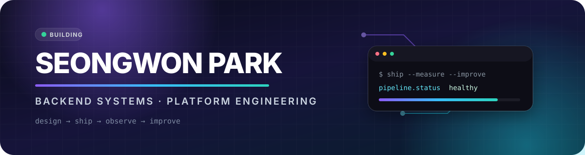

<div align="center">



<br/>

[](https://seongwonp-portfolio.vercel.app/)
[](https://www.linkedin.com/in/seongwon-park-10108035b/)
[](https://velog.io/@opentime_kr)
[](mailto:swp20138993@gmail.com)

### I build backend systems, then stay around to see how they behave.

FastAPI and Spring Boot are my usual tools.<br/>
I enjoy the part after “it works”: deployment, load testing, failure analysis, and the next iteration.

<sub>만들고 끝내기보다, 직접 운영하고 측정하면서 다음 개선점을 찾습니다.</sub>

</div>

<br/>

## `01 / WHAT I BUILD`

<table>
<tr>
<td width="33%" valign="top">

### 🚗 Streaming systems

MQTT, Kafka, time-series storage, consumer design, and load tests that check the final stored result—not just queue health.

</td>
<td width="33%" valign="top">

### 📄 Deterministic pipelines

Parsers, layout engines, stable IDs, snapshot tests, and one-way data flows with explicit layer boundaries.

</td>
<td width="33%" valign="top">

### 🔐 Reliable web services

Authentication, payments, async workers, caching, monitoring, recovery paths, and security-conscious API design.

</td>
</tr>
</table>

## `02 / SELECTED WORK`

<table>
<tr>
<td width="50%" valign="top">

### [Telemetrix](https://github.com/Seongwonp/vehicle-telemetry-platform) · `Java`

Vehicle telemetry platform built around MQTT → Kafka → storage and anomaly consumers.

`load testing` `architecture decisions` `time-series data`

**Found a silent 50% data-loss bug and recovered storage throughput to 98.5% of target.**

</td>
<td width="50%" valign="top">

### [Han-Flow](https://seongwonp-portfolio.vercel.app/#projects) · `TypeScript`

Read-only macOS HWPX viewer with a one-way parser → layout → paint → PDF pipeline.

`parser boundaries` `deterministic IDs` `visual regression`

**The parser never knows React; the layout engine never knows ZIP or XML.**

</td>
</tr>
<tr>
<td width="50%" valign="top">

### [HoneyRest](https://github.com/Seongwonp/honeyRest_user) · `Java`

Booking platform split across user, host, and admin applications. I led service integration and shared database design.

`Spring Boot` `team leadership` `system integration`

**Three applications, one product flow, and a lot of debugging at the seams.**

</td>
<td width="50%" valign="top">

### [AIDA](https://github.com/Seongwonp/AIDA) · `Python`

Training-data quality experiment using KITTI, YOLOv8, and 13 injected error conditions.

`experiment design` `FastAPI` `React dashboard`

**Experiment, backend, and frontend are connected by one explicit CSV contract.**

</td>
</tr>
</table>

<details>
<summary><b>More things I have built</b></summary>

<br/>

- [Touch Bridge](https://github.com/Seongwonp/touch_bridge) — accessible IoT interface for existing home appliances
- [No-Click](https://github.com/Seongwonp/NoClick) — AI-assisted review analysis for promotional content and missing drawbacks
- [AI Exam Generator](https://github.com/Seongwonp/CSAT_Forge) — a deployed exam-question service where I learned payments, workers, monitoring, and recovery
- [Go Practice](https://github.com/Seongwonp/Go_Practice) — concurrency, HTTP, transactions, testing, and performance notes

</details>

## `03 / TOOLBOX`

<div align="center">

**Backend & API**


**Data & messaging**


**Build, ship & observe**


</div>

## `04 / GITHUB IN MOTION`

<div align="center">


<br/>


</div>

<details>
<summary><sub>How the language card is calculated</sub></summary>

<sub>
<code>honeyRest_host</code> is excluded because it vendors about 11.4 MB of third-party JavaScript libraries under its static assets. The chart weights both code size and repository count; it shows repository composition, not a proficiency score.
</sub>

</details>

## `05 / RIGHT NOW`

```text
studying       Information Security @ University of Suwon
measuring      telemetry throughput, stored-data integrity, and query bottlenecks
building       a deterministic HWPX rendering pipeline
learning       where backend design meets security, IoT, and product operations
```

<div align="center">

### Good systems are not just built. They are observed.

If you want to talk about backend systems, strange bugs, or an ambitious project:

[](mailto:swp20138993@gmail.com)

</div>
